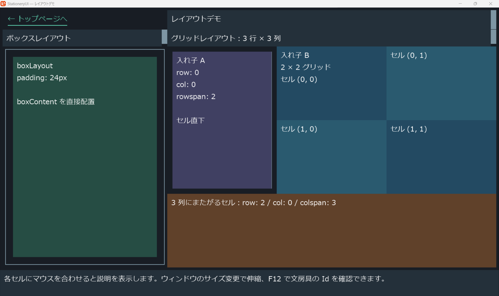
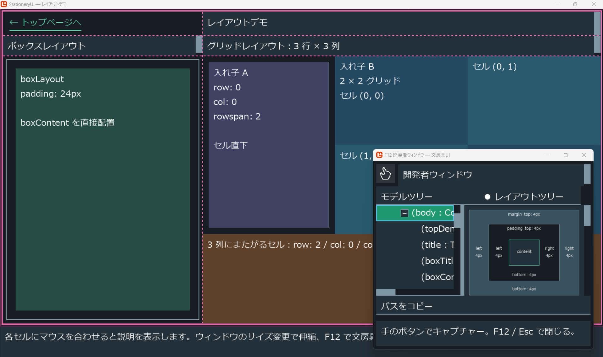
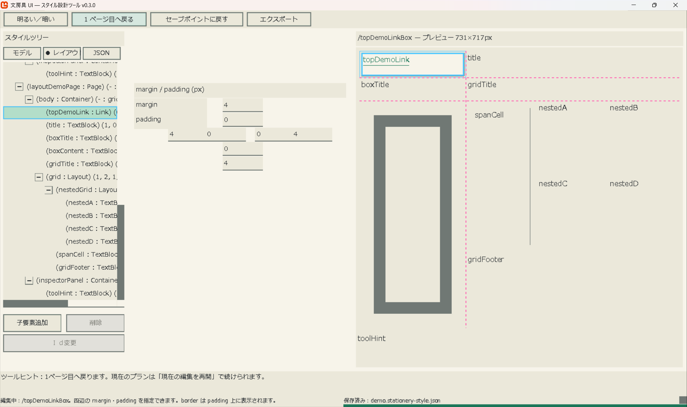

# StationeryUI — 文房具UI

アプリケーションの画面レイアウトをする仕組みです。  

  
（👆 画面は開発中のものです。 v0.3.0 デモ）  

  
（👆 画面は開発中のものです。 v0.3.0 開発者ウィンドウ）  

  
（👆 画面は開発中のものです。 v0.3.0 スタイルデザイナー）  

## 利用したい

- [これはいつどのように使われるか](docs/user/use-cases/overview.md) - シナリオ形式の読み物。
    - [文房具ＵＩフレームワークをすぐ使いたい](docs/user/get-started/framework.md)
	- **[スタイルデザイナーをすぐ使いたい — 最新のリリース](https://github.com/muzudho/StationeryUI/releases/latest)**：Assets からスタイル設定エディターの ZIP を入手。
- [これはどのような製品か](docs/user/products.md)：エディターと文房具 UI の役割・対応範囲。
- **[利用者向けドキュメント](docs/user/README.md)**：製品の説明、使われる場面、起動と操作。

## 開発に貢献したい

ソースを改善する方、アプリへ文房具 UI を組み込む方は、こちらからお読みください。

- **[開発者向けドキュメント](docs/dev/README.md)**：組み込み、設計・実装、ビルドと検証への案内。
- [貢献方法](docs/dev/CONTRIBUTING.md)：変更・不具合報告の進め方。
- [開発日誌 — 2026年9月](docs/dev/log/2026/09.md)：最新の開発経緯。
- [配布・リリース手順](docs/dev/distribution/README.md)：成果物の作成と公開。

## ライセンス

[MIT License](LICENSE)。抽出元と依存物の表示は [第三者ライセンス](THIRD-PARTY-NOTICES.md)を参照してください。
